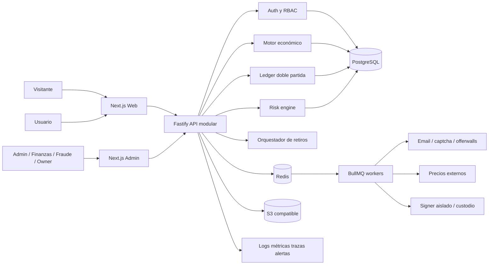
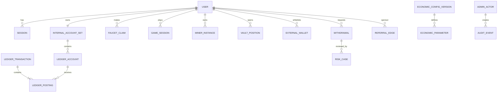
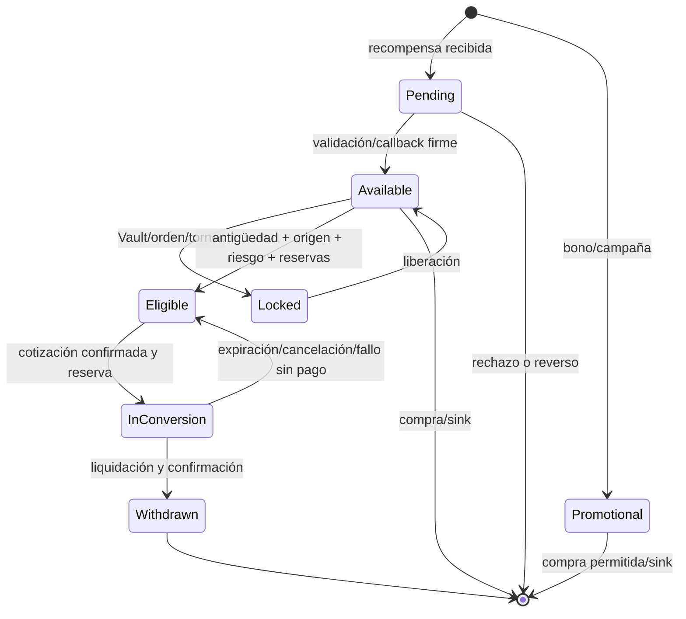
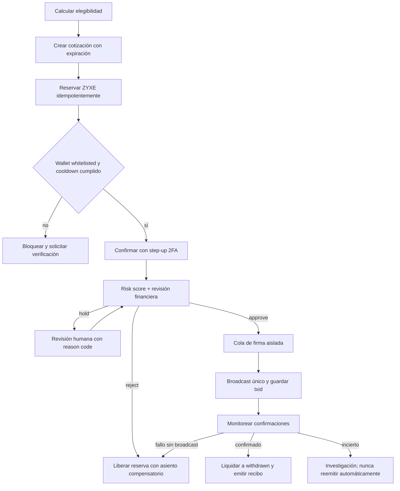

# Fauzet / ZYXE — Diagnóstico y roadmap técnico integral

**Fecha:** 13 de julio de 2026
**Estado:** beta cerrada técnica desplegada; frontend canónico, API y migraciones publicados y verificados en producción
**Fuentes canónicas:** `data/Fauzet_Ficha_Tecnica_Funcionamiento_v0.1.docx` y `data/Fauzet_ZYXE_Documentacion_Tecnica_Economica_v0.1.docx`

## 0. Estado canónico — revisión corregida del 13 de julio de 2026

Esta sección es la fuente de verdad del estado actual y reemplaza cualquier diagnóstico histórico contradictorio del resto del documento. Las secciones posteriores conservan arquitectura, reglas económicas y antecedentes, pero sus frases sobre el punto de partida deben leerse como historia del proyecto.

### 0.1 Corrección obligatoria sobre el frontend

`frontend/` **no es una referencia opcional ni un boceto**. Contiene el frontend completo creado previamente con Claude y su UX está congelada:

- `frontend/index.html`: landing EN/ES, temas claro/oscuro, responsive y todas sus secciones.
- `frontend/app.html` + `frontend/js/app-data.js`, `app-views.js` y `app-main.js`: experiencia completa del usuario.
- `frontend/admin.html`: consola administrativa standalone con su lógica inline.
- `frontend/Fauzet *.dc.html`: fuentes originales de Claude Design.
- `frontend/assets/`: identidad visual e iconografía aprobadas.

El percance fue construir y desplegar en `apps/web` una interfaz Next.js funcional pero visualmente distinta e incompleta. Vercel está correctamente configurado para servir `apps/web`; lo incorrecto fue no portar allí con fidelidad el frontend congelado antes de conectarlo al backend.

Reglas obligatorias desde ahora:

1. `frontend/` es la **especificación visual y de interacción canónica**.
2. `apps/web` seguirá siendo la aplicación de producción porque permite sesiones seguras, rutas, SSR y conexión con la API, pero debe reproducir fielmente landing, app y admin originales.
3. No se rediseñará, simplificará ni sustituirá una pantalla sin aprobación explícita del propietario.
4. Se reemplazarán únicamente simulaciones, `localStorage`, acciones inseguras y datos hardcoded por API, estados reales y controles server-side.
5. Cada migración requerirá comparación visual desktop/móvil, tema claro/oscuro e idioma ES/EN contra el prototipo.
6. Toda publicación futura requerirá comparación visual, CI verde, backup cuando aplique, candidata aislada y smoke test antes de promover.

La aplicación Claude contiene 14 destinos de usuario y el admin 16 entradas (8 módulos diseñados y 8 placeholders). Las rutas inexistentes no se simularán: se integrarán solo con backend real o permanecerán gated y claramente rotuladas.

### 0.2 Dónde estamos realmente

| Área            | Activo en producción                                                              | Completado en este release                                                                                                              | Pendiente real                                                                              |
| --------------- | --------------------------------------------------------------------------------- | --------------------------------------------------------------------------------------------------------------------------------------- | ------------------------------------------------------------------------------------------- |
| Frontend        | `apps/web` fiel a la landing, autenticación y shell aprobados, servido por Vercel | Landing Claude, dashboard, rail global, wallet/historial, ajustes, favicon y admin portados a Next.js con datos reales y smoke superado | Continuar la fidelidad y funcionalidad de cada vertical especializada                       |
| Backend         | Fastify en Cloud Run, revisión `fauzet-api-00003-feg` con 100% del tráfico        | Rutas de perfil e historial personal; corrección de contexto Faucet                                                                     | Monitoreo, alertas, métricas operativas y siguientes integraciones                          |
| Datos           | PostgreSQL en Cloud SQL, ledger y 21 migraciones aplicadas                        | Esquema fiat aditivo con productos, órdenes, intentos, webhooks, inventario y reembolsos; catálogo COP sembrado sin productos activos   | Outbox, conciliación automática, alertas y reportes operativos                              |
| Email           | Resend verificado; registro y activación por correo comprobados                   | —                                                                                                                                       | Monitorear rebotes/entrega y probar recuperación periódicamente                             |
| Auth            | Registro, login, verificación, recuperación y sesiones persistentes               | UI de seguridad/perfil ampliada                                                                                                         | TOTP 2FA, alertas, Google/Firebase y recuperación reforzada                                 |
| Rewards         | Faucet, misiones, minería virtual, tienda y Crew con lógica server-side           | Faucet desligado de IP proxy volátil; IP continúa en riesgo/límites; rutas publicadas y probadas                                        | Reconciliar pools y reforzar controles operativos                                           |
| Economía        | Ledger de doble partida, siete buckets y ZYXE interno                             | Pruebas unitarias/integración verdes                                                                                                    | Reconciliación automática, alertas y reportes operativos                                    |
| Conversión      | Sandbox sin valor real                                                            | Sección Swap marcada como futura                                                                                                        | Custodia, liquidez, KYC/AML y legal antes de activar valor externo                          |
| Pagos fiat      | Catálogo e inventario sandbox informativos; cobros y activaciones bloqueados      | Contratos, persistencia, API y vistas separadas de la tienda ZYXE; gates fail-closed y 13 productos COP sin recompensas                 | Checkout MP, webhook firmado, verificación del pago, fulfillment, reembolsos y conciliación |
| Infraestructura | GitHub, CI, Vercel, Cloud Run, Cloud SQL y jobs                                   | PR #2 fusionado; CI verde; backup, migraciones, API/jobs y Vercel promovidos; GA, GTM y Clarity bajo consentimiento                     | Observabilidad y alertas mínimas de producción                                              |

**Conclusión:** el núcleo de la beta cerrada está publicado con frontend aprobado y autoridad server-side. La prioridad inmediata pasa a ser observabilidad y el agregado de pagos fiat en sandbox; dinero real continúa bloqueado.

### 0.3 Qué está probado

- Registro, entrega de correo y activación real de cuenta con Resend: confirmados.
- Backend, ledger, Faucet, rewards y flujos sandbox: cubiertos por pruebas automatizadas.
- Suite local: formato del alcance modificado, lint, tipos, build productivo de 25 rutas, 19 pruebas web y 97 pruebas API con integración PostgreSQL: verdes.
- Cloud Run, Cloud SQL y Vercel: operativos.
- Credenciales de prueba de Mercado Pago: configuradas por el propietario; no deben copiarse al código, chat ni GitHub.
- Claves publicable y secreta de Stripe: prefijos de test validados localmente sin mostrar valores; integración y webhook aún no existen.
- Google Analytics `G-W8GWS1R97E`, Google Tag Manager `GTM-TVLTFNJG` y Microsoft Clarity `xly1yjpewc`: disponibles únicamente en producción, bloqueados hasta consentimiento y descargados al entrar a la app mediante navegación completa.
- Release de producción: PR #2 fusionado en `main` (`1597750`), CI verde, backup `pre-release-59d28f6d241a` exitoso y candidata API validada antes de recibir tráfico.
- `fauzet.app`: landing canónica, app, ajustes, wallet, admin, términos, privacidad y assets con respuesta `200`; proxy sin sesión responde `401`.

### 0.4 Qué todavía no puede considerarse terminado

- Las verticales especializadas aún requieren iteración de fidelidad y funcionalidad; juegos futuros, Vault, swap y retiros continúan rotulados como no disponibles.
- No hay pagos Mercado Pago funcionando: tener credenciales no equivale a checkout, webhook ni conciliación.
- No hay pagos Stripe funcionando: las claves test no equivalen a checkout, PaymentIntent, webhook ni conciliación.
- Firebase/Google Auth, KYC, custodia y demás terceros siguen pendientes o en proceso.
- No hay criptomonedas reales, swaps reales, depósitos ni retiros on-chain habilitados.
- Minería sigue siendo virtual y recompensa ZYXE desde un pool interno.
- 2FA, KYC real, medios de pago guardados mediante tokens, facturación real y seguridad financiera reforzada siguen incompletos.

### 0.5 Decisiones de producto

#### Qué significa “minar” en Fauzet

Fauzet no debe afirmar que el navegador o los mineros virtuales extraen BTC, ETH u otra red si no ejecutan trabajo verificable en esa blockchain. El producto correcto es **minería virtual gamificada**: el usuario aporta hashpower virtual y recibe una recompensa financiada por un pool.

Se proponen tres niveles:

1. **Ahora:** minar virtualmente ZYXE, como ya funciona.
2. **Piloto:** permitir elegir un único activo de recompensa real, por ejemplo una stablecoin o una criptomoneda de comisiones bajas. El hashpower calcula la participación, pero el activo sale de tesorería; no se “mina” técnicamente.
3. **Después:** catálogo multi-activo. Cada activo tendrá pool financiado, red, precisión, mínimo, fee, límites, precio, disponibilidad, política de riesgo y kill switch independientes.

No se habilitará “cualquier cripto” de forma abierta. Cada activo nuevo necesita respaldo real, liquidez, custodia, monitor de red, reconciliación y aprobación legal.

#### Compras de boosts y mineros

La tienda tendrá dos formas de pago separadas:

- **Saldo interno:** ZYXE disponible/promocional, como ahora.
- **Dinero fiat:** Mercado Pago o Stripe mediante checkout alojado/componentes tokenizados. Fauzet nunca almacenará número de tarjeta ni CVV.

La API de Mercado Libre no sustituye una integración de pagos. Para Colombia, la cuenta y credenciales necesarias son de **Mercado Pago**. La primera integración recomendada es un solo proveedor, con ambiente de prueba, webhook firmado, idempotencia, conciliación, reembolso y contracargo; el segundo proveedor se añade solo si existe una razón comercial.

El catálogo COP entregado **no puede reutilizar directamente** el flujo actual `StorePurchase`: hoy ese flujo debita ZYXE y activa el beneficio en la misma transacción, mientras el catálogo fiat exige comprar primero y activar después. Se implementará un agregado separado:

```text
Mercado Pago/Stripe → PaymentOrder → pago verificado → Entitlement PURCHASED
                                                       ↓ activación del usuario
                                              boost/minero con vigencia real
```

La primera beta fiat tendrá una orden por producto, cantidad uno, COP, Checkout Pro alojado, inventario separado y reembolso total únicamente antes de activación/consumo/beneficio. Dripper Mini, Flow One y Aqua Rig podrán entrar a sandbox; Zyxe Core y Neon Forge permanecerán `COMING_SOON`. `Quick Claim`, `Game Pulse` y `Full Accelerator` no se venderán hasta que Faucet/Juegos consuman sus reglas exclusivamente en servidor. Dinero real continuará deshabilitado.

#### Swap

El primer Swap será contable y custodial, no un DEX:

1. El usuario selecciona activo origen/destino.
2. El servidor obtiene precio de una fuente aprobada y crea una cotización de corta duración.
3. La cotización muestra precio, spread, comisión Fauzet, costo de red estimado y total final.
4. Al confirmar, el ledger reserva el origen y acredita el destino solo si hay liquidez.
5. La tesorería concilia la operación con custodio/exchange.

“GAS” debe mostrarse como **fee de red** únicamente cuando exista una transacción on-chain real. En swaps internos se mostrará “comisión de conversión” o “spread”; no se cobrará gas ficticio. Se requieren límites diarios/mensuales, KYC por umbral, allowlist de activos/países, protección contra precios obsoletos y kill switch.

### 0.6 Centro de Ajustes — alcance aprobado para el roadmap

El nuevo menú **Ajustes** tendrá estas áreas:

- **Apariencia:** tema claro/oscuro/sistema, idioma, zona horaria, accesibilidad y preferencias de notificación.
- **Perfil:** avatar con moderación/tamaño/tipo, nombre visible, username único con cooldown, fecha de nacimiento, país, dirección y contactos verificados.
- **Seguridad:** cambio de contraseña, recuperación, historial de acceso, sesiones/dispositivos, cierre remoto, alertas, TOTP 2FA, códigos de recuperación y passkeys en una fase posterior.
- **Identidad/KYC:** estado, nivel, proveedor, consentimiento, documentos y revisión. Los documentos vivirán en almacenamiento cifrado del proveedor o bucket privado, nunca públicos.
- **Wallets y pagos:** wallets externas con red y verificación; medios fiat tokenizados por el procesador; agregar/quitar/preferido sin guardar PAN/CVV.
- **Facturación:** razón social/nombre, identificación fiscal, dirección, país, comprobantes, historial de compras, reembolsos y exportación.
- **Privacidad:** descarga de datos, consentimientos, cierre de cuenta y solicitud de eliminación sujeta a retención legal/contable.

### 0.7 Lo que debe hacer el propietario — punto por punto

No compartas claves privadas, seed phrases ni API secrets por chat o GitHub. Cuando una integración esté lista, guarda el secreto en Google Secret Manager y comparte solo el nombre del secreto.

#### A. Ya completado por ti

- [x] Proyecto GCP `fauzet` y dominio `fauzet.app`.
- [x] Resend verificado y correos reales de activación comprobados.
- [x] Credenciales de prueba de Mercado Pago configuradas.
- [x] Claves publicable y secreta de Stripe en modo test configuradas localmente y validadas por prefijo, sin exponer valores.
- [x] Tabla inicial de boosts/mineros, precios COP y política operativa de reembolso en `data/Fauzet_Tabla_Boosts_Mineros_y_Politica_Reembolsos_v0.1.docx`.
- [x] País base informado: Colombia, con RUT y operación inicial a título/estructura local por definir legalmente.
- [x] Presupuesto exploratorio informado: aproximadamente 300.000 COP.

#### B. Mercado Pago — lo próximo que debes decidir

1. El valor configurado con prefijo `APP_USR-` es compatible con un **Access Token de prueba**; no lo cambies ni lo envíes por chat. Desarrollo lo validará creando una preferencia sandbox antes de habilitar checkout.
2. Busca en Mercado Pago Developers el **Seller User ID numérico** de la cuenta vendedora de prueba. La variable actual llamada “API user” parece otro token y no sirve como ese ID.
3. Déjalo únicamente en variables locales/Secret Manager bajo `MERCADOPAGO_SELLER_USER_ID`; comparte solo el nombre del secreto, nunca el valor.
4. La moneda inicial del checkout queda definida como `COP` por el catálogo entregado.
5. La tabla inicial de productos ya fue entregada: en beta se priorizarán los mineros Dripper Mini, Flow One y Aqua Rig; boosts y mineros superiores permanecen cerrados hasta implementar sus efectos server-side.
6. La política preliminar ya fue entregada: solicitud dentro de cinco días hábiles mientras el producto no haya sido activado/consumido ni generado beneficios, sujeta a los casos y derechos legales aplicables.
7. Cuando desarrollo entregue la URL HTTPS, regístrala como webhook de pagos en Mercado Pago y guarda el secreto de firma en Secret Manager como `MERCADOPAGO_WEBHOOK_SECRET`.
8. Crea o conserva las cuentas de comprador/vendedor de prueba que proporcione MP; no uses una compra real durante sandbox.

**Nombres que usará el runtime:** `MERCADOPAGO_ACCESS_TOKEN`, `MERCADOPAGO_WEBHOOK_SECRET`, `MERCADOPAGO_APPLICATION_ID`, `MERCADOPAGO_SELLER_USER_ID` y `MERCADOPAGO_MODE=test`. Access Token y secreto del webhook vivirán únicamente en Secret Manager; usuario, contraseña y código de comprador de prueba no pertenecen al runtime.

**Lo que hará desarrollo:** detectar la configuración sin exponerla, crear el adaptador, órdenes, checkout, webhook firmado/idempotente, acreditación exact-once, reembolsos, contracargos, recibos y conciliación.

#### C. Stripe — en proceso por ti

1. Termina el alta y verificación de la cuenta, sin frenar la integración sandbox de Mercado Pago.
2. Comprueba que Stripe permite tu modelo de negocio, países objetivo y productos digitales/recompensas.
3. Test mode y las dos claves test ya están presentes. No las copies al chat ni a GitHub.
4. Al integrar, renombra las variables genéricas a `STRIPE_PUBLISHABLE_KEY` y `STRIPE_SECRET_KEY`; la secreta irá a Secret Manager, no a Vercel.
5. Más adelante crea el endpoint de webhook en Stripe y guarda su `STRIPE_WEBHOOK_SECRET` (`whsec_…`). Todavía no existe y no se puede obtener antes de registrar el endpoint.
6. Stripe será el segundo adaptador para expansión internacional, no una dependencia del primer checkout.

#### D. Fondeo y custodia cripto

1. **Define la empresa:** escribe el país donde está registrada o se registrará Fauzet y los países donde aceptarás usuarios. Sin esto un proveedor no puede aprobarte.
2. **Habla con un abogado fintech/cripto:** pídele por escrito si Fauzet puede vender recompensas, custodiar activos, convertirlos y pagar retiros en esos países; además, qué KYC/AML, edades, impuestos y licencias aplican.
3. **Elige un solo activo piloto:** no BTC + ETH + DOGE + USDT a la vez. Define `activo`, `red`, `monto total de prueba`, `mínimo por retiro` y `máximo diario por usuario`. Recomendación operativa: comenzar con una stablecoin en una sola red barata, sujeto al concepto legal y disponibilidad del proveedor.
4. **Pide demos/cotizaciones a dos custodios:** por ejemplo, soluciones empresariales de wallets/custodia. Pregunta por disponibilidad en tu país, precio mensual, redes/activos, MPC/HSM, whitelists, doble aprobación, webhooks, sandbox, screening AML, seguros, recuperación y SLA.
5. **Abre la cuenta empresarial:** completa KYB de la empresa y beneficiarios finales. Una cuenta personal de exchange no debe ser la tesorería de producción.
6. **Crea tres bolsillos:** reserva fría, tesorería operativa y hot wallet limitada para pagos. Nunca pongas todo el fondo en la hot wallet.
7. **Define el presupuesto piloto:** dinero que puedes perder sin afectar la empresa. Ese será el máximo del reward pool; el software no podrá emitir más.
8. **Entrega a desarrollo solo datos no secretos:** nombre del custodio, ambiente sandbox, activo/red, IDs públicos, límites y nombres de secretos. Las llaves de retiro deben quedar con permisos mínimos, allowlist y doble aprobación.

Las APIs de Binance pueden servir más adelante para precio/liquidez o conciliación si la cuenta empresarial y sus términos lo permiten, pero no reemplazan automáticamente custodia, KYC, contabilidad ni aprobación legal. No se conectarán claves con permiso de retiro durante el prototipo.

#### E. Google Auth/Firebase

1. En Firebase habilita Authentication → Sign-in method → Google.
2. Agrega `fauzet.app` a dominios autorizados.
3. Configura la pantalla de consentimiento con nombre, logo, correo de soporte, privacidad y términos.
4. Comparte el `projectId` y la configuración web pública; guarda cualquier credencial privada/service account en Secret Manager.
5. No reemplazaremos el usuario actual: vincularemos Google por email verificado y evitaremos cuentas duplicadas.

#### F. Terceros que debes investigar — uno por categoría

No contrates todavía sin revisar costos, soporte para Colombia y compatibilidad legal. Necesitamos candidatos para:

1. **KYC/AML:** verificación de identidad, prueba de vida, screening y webhooks; pregunta países, costo por verificación y almacenamiento de documentos.
2. **Custodia/wallet empresarial:** Polygon/USDC, sandbox, MPC/HSM, allowlist, doble aprobación, webhooks y KYB para Colombia.
3. **Liquidez/precios:** cotizaciones y, más adelante, ejecución/conciliación; una API personal de exchange no reemplaza custodia empresarial.
4. **Antifraude de pagos:** primero usaremos señales de MP/Stripe más nuestras reglas; evaluar un tercero solo si el volumen lo justifica.
5. **Soporte:** define correo y procedimiento para cuenta bloqueada, pago faltante, KYC y retiro en revisión.

Envíanos únicamente nombres, enlaces, precios y capacidades. Nunca llaves, seed phrases ni credenciales.

#### G. Decisiones que todavía debes entregar

- Forma jurídica/operativa en Colombia y lista inicial de países permitidos; “todo el mundo” será una expansión progresiva por allowlist.
- Confirmación final del piloto propuesto: `USDC` sobre `Polygon PoS`, usando `POL` solo para fees de red.
- Distribución de los 300.000 COP: reserva, reward pool y costos operativos; nunca todo en hot wallet.
- Mínimo de retiro, máximo diario por usuario y presupuesto diario del pool.
- Custodia: empresarial gestionada o wallet controlada por usuario.
- Proveedor KYC/KYB.
- Activos del futuro Swap y fórmula de comisión/spread.
- Edad mínima, correo de soporte y países expresamente bloqueados.
- Más adelante, antes de dinero real: concepto legal, términos, privacidad, AML/KYC, impuestos y política de recompensas/retiros.

### 0.8 Roadmap corregido y orden de ejecución

**Decisiones registradas:** operación inicial desde Colombia; expansión internacional solo por lista de países habilitados; presupuesto exploratorio de 300.000 COP; Polygon PoS como candidata; USDC como activo real piloto recomendado y POL únicamente para gas; ZYXE continúa como unidad interna. El catálogo multi-activo futuro evaluará BTC, BCH, DASH, DOGE, LTC, USDC y ZYXE, cada uno con pool y gate independiente.

#### R0 — Recuperación e integración fiel del frontend (release base completado)

- [x] Inventariar vistas, estados y navegaciones de `frontend/index.html`, `app.html` y `admin.html`.
- [x] Crear matriz pantalla original → ruta Next → endpoint API → estado de integración.
- [x] Consolidar los 38 assets originales sin alterar marca, proporciones ni estilo aprobado.
- [x] Portar la landing original a componentes Next preservando EN/ES, claro/oscuro, responsive, contenido, SEO y telemetría productiva.
- [x] Publicar condiciones y privacidad provisionales versionadas para la beta; registrar las versiones aceptadas y exigir nuevo consentimiento antes de dinero real.
- [x] Portar autenticación/onboarding con la misma UX y backend real; Google se muestra honestamente como próximo.
- [x] Portar shell/dashboard original; integrar datos reales y eliminar cifras demostrativas engañosas.
- [x] Portar wallet con siete buckets e historial personal derivado del ledger, sin valoración fiat inventada.
- [x] Portar el admin original sobre RBAC, step-up y auditoría existentes; módulos inexistentes quedan `GATED`.
- [ ] Terminar la fidelidad de cada vertical especializada: Faucet, misiones, minería, tienda, Crew, conversión y soporte.
- [x] Validar desktop/móvil, loading/error/empty/accessibility, lint, tipos, pruebas y build productivo; el navegador raíz quedó limitado por un fallo del entorno, pero hubo revisión visual independiente.
- [x] Publicar, aplicar migraciones, desplegar API/web y ejecutar smoke de producción en `fauzet.app`.

#### R1 — Estabilización funcional inmediata

- [x] Shell/menu persistente por iconos en todas las rutas autenticadas, incluido Faucet.
- [x] Favicon, iconos y metadata; manifest instalable queda pendiente.
- [x] Contexto del Faucet ligado a sesión/dispositivo con IP conservada para límites/riesgo; 89 pruebas verdes y release publicado.
- [x] E2E persistente de registro → verificación → claim → balance en PostgreSQL local.
- [x] Entrega real Resend y activación de cuenta confirmadas por el propietario.
- [ ] Monitoreo de errores, logs correlacionados y alertas mínimas.

#### R2 — Identidad, perfil y seguridad

- [x] Centro de Ajustes con Perfil, Apariencia, Seguridad, Pagos, Facturación, KYC y Privacidad publicado.
- [x] Tema claro/oscuro/sistema persistente.
- [x] Avatar validado, username, contactos, privacidad y cierre/exportación.
- [ ] Recuperación por email y sesiones/dispositivos listas; falta cambio autenticado de contraseña y alertas de acceso.
- [ ] TOTP 2FA, códigos de recuperación y step-up para acciones sensibles.
- [ ] Google Auth con Firebase y vinculación segura de cuentas.
- [ ] Estado KYC incorporado al perfil; falta seleccionar proveedor y construir su adaptador sandbox.

#### R3 — Mercado Pago sandbox y monetización fiat

- [x] Credenciales de prueba de Mercado Pago configuradas por el propietario.
- [x] Catálogo fiat COP y política preliminar de reembolsos entregados.
- [x] Verificar presencia de la configuración actual sin imprimirla ni versionarla; el token `APP_USR-` es compatible con test, pero falta Seller User ID numérico y webhook secret.
- [x] Diseñar la separación obligatoria entre compra ZYXE actual y compra fiat con inventario/activación posterior.
- [x] Modelos versionados `FiatProductVersion`, `PaymentOrder`, `PaymentAttempt`, `PaymentWebhookInbox`, `Entitlement` y `PaymentRefund`, con constraints de importe, identidad, pago y fulfillment.
- [x] Catálogo COP e inventario autoritativo en API/web, separados de la tienda ZYXE; sin órdenes, cobros, activaciones ni recompensas ZYXE.
- [x] Gates `FIAT_CATALOG_ENABLED`, `FIAT_SANDBOX_CHECKOUT_ENABLED` y `FIAT_SANDBOX_ACTIVATION_ENABLED`; producción rechaza checkout/activación mientras no estén implementados.
- [ ] Outbox, worker de conciliación y estados explícitos de contracargo.
- [ ] Adaptador de pagos abstracto con Mercado Pago Checkout Pro como proveedor sandbox inicial.
- [ ] Checkout alojado, webhooks firmados e idempotentes y fulfillment efectivamente una vez.
- [ ] Órdenes, pagos, inventario, activación, recibos, reembolsos totales no activados y contracargos.
- [ ] Implementar mineros temporales y los efectos server-side del catálogo antes de vender cada SKU.
- [ ] Conciliación diaria y separación entre ingresos, impuestos, rewards y owner available.
- [x] Claves Stripe test validadas por prefijo; falta normalizar nombres y crear el webhook.
- [ ] Stripe como segundo proveedor solo después de estabilizar MP y aprobar la cuenta/modelo de negocio.

#### R4 — Piloto cripto real con un activo

- [ ] Concepto legal, KYB/KYC/AML y políticas aprobadas.
- [ ] Custodio empresarial sandbox, whitelists, doble aprobación y signer aislado.
- [ ] Registro de activos/redes, precios, fees y límites versionados.
- [ ] Reward pool realmente fondeado y reconciliado.
- [ ] Minería virtual con selector del activo piloto y textos no engañosos.
- [ ] Retiros allowlisted, límites bajos, revisión manual y kill switch ensayado.

#### R5 — Multi-activo y Swap

- [ ] Segundo activo solo después de reconciliar el piloto.
- [ ] Motor de cotizaciones, reservas, spread/comisión y liquidez.
- [ ] Ledger multi-activo, precisión por token y contabilidad de fees.
- [ ] Swap interno primero; ejecución externa/on-chain después.
- [ ] Monitoreo de precios, slippage, exposición de tesorería y fallos de red.

#### R6 — Juegos y expansión

- [ ] Revisión de UX, catálogo y economía de juegos.
- [ ] Nuevos juegos solo con validación server-side, antifraude y budgets.
- [ ] Temporadas, torneos y contenido después de estabilizar valor externo.

### 0.9 Gates obligatorios

No se activarán depósitos, swaps o retiros reales hasta que existan: concepto legal escrito; empresa/KYB; proveedor KYC/AML; custodio empresarial; activo/red y límites aprobados; pool financiado; reconciliación; alertas; backup/restore probado; pentest; doble aprobación; soporte; términos/políticas; y prueba documentada de los kill switches.

## 1. Línea base histórica del diagnóstico inicial

> Esta sección describe el repositorio al inicio del proyecto. No representa el estado vigente; para decisiones y planificación prevalece la sección 0.

### Resumen ejecutivo histórico

Fauzet tiene una especificación funcional/económica amplia, una identidad visual terminada y un prototipo navegable que cubre casi toda la experiencia prevista. No existe todavía una aplicación de producción: no hay repositorio Git, manifiestos de dependencias, backend, base de datos, autenticación real, ledger, infraestructura, pruebas ni integraciones. Todos los saldos y acciones del prototipo viven en datos hardcoded o `localStorage` y pueden alterarse desde el navegador.

La construcción debe comenzar como **monolito modular** con tres superficies separadas: web pública, app autenticada y consola administrativa. El núcleo económico debe ser server-authoritative, transaccional y de doble partida. La beta cerrada no tendrá dinero real, retiros reales ni trading real. Esas capacidades se habilitarán únicamente después de superar gates explícitos de sostenibilidad, seguridad, tesorería y cumplimiento.

### Diagnóstico por activo

| Área          | Estado actual                          | Riesgo / oportunidad                                                           | Acción                                           |
| ------------- | -------------------------------------- | ------------------------------------------------------------------------------ | ------------------------------------------------ |
| Documentación | Dos DOCX completos y dos extractos TXT | Los TXT tienen mojibake y entidades HTML; el DOCX es la fuente canónica        | Versionar requisitos y decisiones abiertas       |
| Landing       | Prototipo visual completo EN/ES        | Contenido/render inline; sin SEO estructurado, analytics ni formularios reales | Migrar conservando diseño y mensajes legales     |
| App           | 18+ módulos navegables                 | Auth, rewards, juegos, economía y retiros son simulaciones locales             | Migrar por verticales contra API                 |
| Admin         | 8 módulos visibles, otros placeholders | Sin login, RBAC, persistencia ni acciones reales                               | Aplicación aislada con step-up auth y auditoría  |
| Branding      | Logos, moneda, iconos y paleta listos  | Duplicación de assets y nombres inconsistentes                                 | Catálogo único y pipeline de optimización        |
| Backend/DB    | Inexistente                            | No hay autoridad, integridad ni trazabilidad                                   | Fastify + PostgreSQL + Redis                     |
| Operación     | Inexistente                            | Sin CI/CD, backups, observabilidad o respuesta a incidentes                    | Infra local reproducible y pipelines por entorno |

### Defectos críticos del prototipo

1. `localStorage` es la autoridad de sesión y saldos; cualquier usuario puede modificarlos.
2. Login, verificación, 2FA y aprobaciones administrativas aceptan acciones sin validación real.
3. Faucet usa `Math.random()` y cooldown local; juegos y misiones no son verificables ni idempotentes.
4. Wallet y dashboard usan fuentes de transacciones distintas; `available`, `eligible`, `locked`, `pending` y `promo` se desincronizan.
5. Conversión/retiro no reserva ni liquida correctamente; el flujo usa tasas inconsistentes y no exige el 2FA mostrado.
6. `innerHTML` y escaping incompleto crean superficie XSS; el admin es accesible por URL sin aislamiento.
7. Hay mojibake literal visible en HTML/JS/TXT. Debe corregirse desde fuente, no con transformaciones en runtime.
8. No hay estados loading/error/empty, manejo de reintentos, accesibilidad de modales ni navegación profunda.

## 2. Fuentes de verdad y reglas no negociables

- La ficha técnica define el ciclo del usuario, los siete estados económicos y el orden de implementación (secciones 3, 4, 7, 8, 11 y 12).
- La documentación económica define modelo de ingresos, pools, sinks, tesorería, ledger, arquitectura, indicadores, riesgos y gates legales (secciones 4–25).
- Los DOCX prevalecen sobre los TXT y sobre cifras hardcoded del prototipo.
- Todo parámetro marcado como hipótesis se guardará como configuración versionada; nunca como constante dispersa.
- ZYXE será saldo interno no transferible durante el MVP. No se acuñará token público.
- No habrá retiros reales en beta cerrada. Trading MVP será educativo/simulado.

## 3. Arquitectura objetivo

### Stack recomendado

| Capa           | Tecnología                                                            | Justificación                                                    |
| -------------- | --------------------------------------------------------------------- | ---------------------------------------------------------------- |
| Monorepo       | pnpm workspaces + Turborepo                                           | Contratos y tooling compartidos sin mezclar despliegues          |
| Web            | Next.js 16, React 19, TypeScript                                      | App Router, SSR/SEO, rutas separadas y componentes reutilizables |
| API            | Fastify + TypeScript + Zod                                            | Validación explícita, buen rendimiento y modularidad             |
| Datos          | PostgreSQL + Prisma                                                   | Transacciones ACID, constraints, migraciones y tipado            |
| Cache/jobs     | Redis + BullMQ                                                        | Cooldowns, locks, rate limits, idempotencia temporal y workers   |
| Auth           | Sesiones opacas en cookie segura + Argon2id + TOTP/WebAuthn posterior | Revocación, dispositivos y step-up auth                          |
| Objetos        | S3 compatible                                                         | Evidencias KYC/fraude y exportaciones fuera de la DB             |
| Observabilidad | OpenTelemetry + Prometheus/Grafana + Sentry                           | Trazas, métricas, errores y alertas                              |
| Infra local    | Docker Compose                                                        | PostgreSQL, Redis, Mailpit y MinIO reproducibles                 |

No se recomiendan microservicios para el MVP. El monolito modular conserva transacciones contables fuertes. Los primeros candidatos a extracción futura son notificaciones, risk engine, market data y blockchain signer.



### Límites de módulos

`identity`, `access`, `ledger`, `economy-config`, `rewards`, `games`, `missions`, `mining`, `store`, `referrals`, `vault`, `market`, `conversions`, `withdrawals`, `treasury`, `risk`, `admin`, `audit`, `notifications`, `support`.

Cada módulo expone casos de uso y eventos; ningún módulo escribe directamente balances de otro. Toda mutación económica pasa por el servicio de contabilización.

## 4. Modelo de datos e invariantes



### Entidades núcleo

- Identidad: `users`, `user_profiles`, `sessions`, `devices`, `email_verifications`, `mfa_methods`, `role_assignments`, `terms_acceptances`.
- Contabilidad: `ledger_accounts`, `ledger_transactions`, `ledger_postings`, `balance_snapshots`, `reconciliation_runs`.
- Economía: `economic_config_versions`, `economic_parameters`, `reward_budgets`, `treasury_accounts`, `treasury_reconciliations`.
- Rewards: `faucet_claims`, `game_sessions`, `game_events`, `missions`, `mission_progress`, `reward_events`, `provider_callbacks`.
- Utilidad: `catalog_products`, `purchases`, `inventories`, `miners`, `energy_events`, `mining_pools`, `mining_settlements`, `vault_positions`, `vault_settlements`.
- Red: `referral_edges`, `referral_ancestors`, `commission_events`, `clawbacks`.
- Mercado/valor externo: `market_quotes`, `orders`, `trades`, `conversion_quotes`, `conversions`, `external_wallets`, `withdrawals`, `blockchain_transactions`.
- Control: `risk_signals`, `risk_scores`, `risk_cases`, `admin_audit_events`, `feature_flags`, `outbox_events`, `idempotency_keys`.

### Invariantes contables

1. Cada transacción posteada suma cero entre débitos y créditos por activo.
2. Los importes usan enteros en unidad mínima o `NUMERIC`, nunca `float`.
3. Un balance es una proyección del ledger, no un campo editable de usuario.
4. Un `source_type + source_id + operation` es único.
5. Un reverso referencia la transacción original y crea asientos compensatorios; no borra ni edita historia.
6. Ninguna cuenta de usuario o tesorería puede quedar negativa salvo cuenta técnica explícitamente autorizada.
7. `promotional` nunca se mueve a `eligible`.
8. `pending`, `locked` y `reserved/conversion` no se pueden gastar ni retirar.
9. El Owner solo debita `treasury:owner:available`; un constraint/policy impide usar rewards, withdrawals, liquidity o security.
10. Cambios administrativos requieren actor, motivo, before/after y, sobre umbral, segunda aprobación.

## 5. Ciclo de vida de saldos



El nombre externo **en conversión** se implementará internamente como una cuenta `reserved:conversion` para evitar ambigüedad con otros bloqueos. `balance_after` será evidencia auxiliar, no fuente de verdad.

## 6. Motor económico

Todas las reglas toman un `economic_config_version_id` y guardan la versión usada en cada transacción.

- **Emisión:** `presupuesto_base + fracción_ingresos - ajuste_inflación - ajuste_fraude - ajuste_reservas`, limitada por pool.
- **Minería:** `(hashpower_válido_usuario / hashpower_total_válido) × pool_diario`; el job de settlement distribuye exactamente el total asignable y registra residuo de redondeo.
- **Vault:** `(peso_usuario / peso_total) × pool_periodo`; multiplicadores iniciales 1.00/1.05/1.15/1.35 son hipótesis configurables.
- **Referidos:** 5/2/1/0.5% preliminar solo sobre base monetizable validada, con cap, actividad, no autocuentas, no comisión sobre comisión y clawback.
- **Compras:** split por producto; default experimental 40% burn, 40% reward pools, 20% treasury.
- **Elegibilidad:** recompensas firmes de origen permitido menos promos, holds, reservas, sanciones, límites y riesgo.
- **Owner available:** ingresos conciliados menos obligaciones, costos, provisiones, reservas y colchón aprobado.

Antes de publicar una versión económica, admin mostrará simulación sobre 7/30/90 días, cambio en pasivos, inflación, cobertura y usuarios afectados. Publicar requiere motivo y doble aprobación cuando cambie convertibilidad o reservas.

## 7. Superficie de API

Prefijo `/v1`. Mutaciones económicas exigen `Idempotency-Key`; las respuestas incluyen `requestId` y versión de contrato.

| Dominio          | Endpoints principales                                                                                             |
| ---------------- | ----------------------------------------------------------------------------------------------------------------- |
| Auth             | `POST /auth/register`, `/login`, `/logout`, `/refresh`, `/verify-email`, `/password/*`, `/mfa/*`; `GET /sessions` |
| Usuario          | `GET/PATCH /me`, `GET /me/devices`, `/me/notifications`, `/me/limits`                                             |
| Dashboard/Ledger | `GET /dashboard`, `/balances`, `/ledger`, `/ledger/:id`                                                           |
| Faucet           | `GET /faucet/status`, `POST /faucet/challenges`, `/faucet/claims`                                                 |
| Juegos           | `POST /games/:game/sessions`, `/events`, `/complete`; `GET /games/catalog`                                        |
| Misiones         | `GET /missions`, `POST /missions/:id/claim`                                                                       |
| Minería/Store    | `GET /miners`, `/mining/status`, `/catalog`; `POST /purchases`, `/miners/:id/energy`                              |
| Vault            | `GET /vault/products`, `/vault/positions`; `POST /vault/positions`, `/:id/close`                                  |
| Crew             | `GET /referrals/code`, `/referrals/tree`, `/referrals/commissions`                                                |
| Mercado          | `GET /market/quotes`; `POST /market/orders`; trading real deshabilitado por flag                                  |
| Conversión       | `POST /conversion-quotes`, `/conversions`; `GET /conversions/:id`                                                 |
| Wallet externa   | `GET/POST /external-wallets`, `POST /:id/verify`, `DELETE /:id`                                                   |
| Retiros          | `GET/POST /withdrawals`, `GET /:id`, `POST /:id/cancel`                                                           |
| Admin            | usuarios, economía, treasury, withdrawals, risk, ledger, audit y content bajo `/admin/*`                          |
| Integraciones    | callbacks firmados bajo `/webhooks/:provider`; health bajo `/health/*`                                            |

Roles: visitante, usuario, usuario verificado, soporte, contenido, fraude, finanzas, auditor, superadmin y owner. La autorización se revalida en cada handler/caso de uso; nunca depende solo del proxy web.

## 8. Seguridad y modelo de amenazas

| Amenaza                  | Control por diseño                                                                                            |
| ------------------------ | ------------------------------------------------------------------------------------------------------------- |
| Robo de cuenta           | Argon2id, cookies HttpOnly/Secure/SameSite, rotación de sesión, TOTP, WebAuthn futuro, alertas de dispositivo |
| Doble claim/pago         | Unique constraints, idempotency, locks cortos y máquina de estados transaccional                              |
| Manipulación de puntajes | Sesión firmada, nonce, secuencia de eventos, límites físicos, anti-replay y validación server-side            |
| Callback falso           | HMAC/clave pública, allowlist, timestamp, raw-body verification y deduplicación                               |
| XSS/CSRF                 | React escaping, CSP estricta, sin HTML no confiable, CSRF/origin checks y cookies SameSite                    |
| Abuso interno            | RBAC mínimo, step-up auth, maker-checker, auditoría append-only y alertas                                     |
| Exfiltración de llaves   | Signer/custodio aislado, KMS/HSM, hot wallet limitada, sin claves en app/DB/repositorio                       |
| Supply chain             | lockfile, Dependabot/Renovate, SBOM, escaneo SAST/secrets/dependencias e imágenes firmadas                    |
| Pérdida de datos         | backups cifrados, PITR, restore drills y reconciliación diaria                                                |

Kill switches independientes para faucet, juegos con rewards, minería, Vault, trading, conversiones, user withdrawals y owner withdrawals.

## 9. Antifraude

Pipeline: evento → señales → score versionado → decisión (`allow`, `challenge`, `hold`, `review`, `reject`) → caso humano → asiento/reverso → aprendizaje de regla.

Señales iniciales: velocidad, IP/ASN/VPN/datacenter/TOR, device binding respetuoso de privacidad, cuentas relacionadas, email desechable, reputación, anomalías de juego, repetición de callbacks, árbol circular, wash trading, cambios recientes de credenciales/wallet y concentración de payouts.

Toda decisión guarda códigos de razón, evidencia, versión del modelo/reglas y actor. Métricas: fraude confirmado, reversos, precision/recall sobre casos resueltos, falsos positivos, aging de cola, tiempo de revisión y pérdida evitada.

## 10. Retiro de extremo a extremo



La beta cerrada usará un adaptador `sandbox` que genera txid ficticio marcado como prueba. El adaptador real no se habilita por configuración accidental: requiere artefacto de aprobación, flag de entorno y credencial ausente en entornos no autorizados.

## 11. Frontend de producción

- Rutas: `/`, `/auth/*`, `/app/*` y `/admin/*`; se recomienda despliegue/admin origin separado en producción.
- Server Components para shells y datos iniciales; Client Components solo para juegos, formularios y controles interactivos.
- TanStack Query para mutaciones/estado remoto; Zod para contratos; localStorage únicamente para idioma/tema.
- Design tokens Fauzet: `#39FF88`, `#7C3AED`, `#22D3EE`, `#080B12`, `#111827`, `#E5E7EB`.
- i18n EN/ES por claves completas, formatos según locale y auditoría que impida strings huérfanos.
- Migración vertical: auth → dashboard/ledger → faucet → games/missions → mining/store → Vault/crew → mercado demo → conversion sandbox → admin.
- Accesibilidad: labels, teclado, focus trap, `dialog`, announcements, contraste, reduced motion y pruebas axe.
- El prototipo queda preservado bajo `legacy-prototype/` como referencia visual, no como código importado en runtime.

## 12. Fases, milestones y gates

### Fase 0 — Fundación y cierre de diseño (Now)

Entregables: monorepo, ADRs, contratos, schema inicial, Docker local, CI, catálogo de assets, corrección de encoding, feature flags y simulador económico básico.

**DoD:** entorno reproducible con un comando; lint/typecheck/test/build verdes; decisiones abiertas registradas con owner y fecha.

### Fase 1 — Beta cerrada, economía interna

Auth/email, dashboard, ledger doble partida, buckets, faucet, Tap Miner, Memory Drops, misiones, wallet/historial, admin básico, auditoría, soporte y notificaciones.

**Aceptación:** un claim y un resultado solo acreditan una vez bajo concurrencia; cada balance reconcilia; pool reparte exactamente su presupuesto; admin no puede editar saldo; pruebas e2e cubren el flujo Mateo. Retiros/trading real deshabilitados.

### Fase 2 — Beta de monetización

Callbacks sandbox/reales de proveedor, rewarded ads/offerwall, catálogo/boosts, inventario, mineros/energía, referidos hasta cuatro niveles detrás de gate legal, tesorería y conciliación de ingresos.

**Gate:** unit economics observables, callback firmado y reversible, fraude dentro del umbral, aprobación legal del modelo referral.

### Fase 3 — Beta pública controlada

Vault interno, temporadas, risk engine avanzado, KYC por umbral, conversiones y retiros sandbox; luego piloto real allowlisted, manual y de límites bajos con un solo activo.

**Gate de dinero real:** concepto jurídico escrito, reservas 3–6 meses, runbook y DR probados, auditoría de seguridad, reconciliación 100%, signer aislado, doble aprobación y kill switch ensayado.

### Fase 4 — Producción

Retiros controlados, SLA operativo, soporte, fraude 24/7 según volumen, automatización progresiva y pruebas de carga/caos. Microtrading real permanece fuera hasta gate propio.

### Fase 5 — Later

Marketplace, más activos, apps móviles y evaluación de token público en red existente. Tokenización requiere auditoría de contrato, legal multijurisdicción, reservas, utilidad orgánica y gobernanza. Red propia queda fuera del alcance inicial.

## 13. Pruebas y QA

- Unitarias: fórmulas, state machines, policies RBAC/riesgo, precisión y redondeo.
- Integración: repositorios, transacciones, outbox, Redis locks, callbacks y workers.
- Property-based: doble partida suma cero, balances no negativos, reversos simétricos, owner isolation.
- Concurrencia: claims, compras, commission settlement y withdrawals repetidos/paralelos.
- E2E: landing→registro→email→onboarding→claim→juego→wallet; admin consulta ledger; sandbox withdrawal en fase habilitada.
- Seguridad: OWASP ASVS, SAST/DAST, dependency/secret scanning, pentest antes de dinero real.
- Antifraude: datasets sintéticos, replay, bot cadence, device farms, callback duplication, referral cycles y wash trading.
- Performance: p95 API, login/claim bursts, daily settlements, admin exports y chain confirmations.
- Recuperación: restore mensual en beta y más frecuente con dinero real; RPO/RTO medidos.

## 14. DevOps y operación

Entornos `local`, `test`, `staging`, `production`; cuentas y secretos aislados. CI ejecuta format, lint, typecheck, unit, integration, migration check, build, SAST y SBOM. CD usa migraciones expand/contract, smoke tests, promoción explícita y rollback de aplicación; las migraciones destructivas requieren backup y aprobación.

SLIs: disponibilidad, latencia p95/p99, errores, lag de jobs, reconciliación, claim success, callback lag, withdrawal aging, cobertura, risk queue. Alertas económicas provienen de la sección 22: inflación, concentración, sostenibilidad, reversos, cobertura y pasivo elegible.

## 15. Cumplimiento y legal

Antes de valor externo: mapa de jurisdicciones, edad/país, Términos, Privacidad, Rewards Policy, Risk Disclosure, Withdrawal Policy, Cookie Policy, AML/KYC/sanciones, protección de datos, consumidor, impuestos, publicidad, juegos y referral compensation.

No usar lenguaje de inversión, APY garantizado, minería real ni ingresos garantizados. El análisis legal del documento es preliminar y debe actualizarse con asesoría jurídica vigente antes de depósitos, custodia, conversión, trading real, Vault con valor externo, cuatro niveles monetarios o token público.

## 16. Decisiones abiertas

| Decisión            | Recomendación de trabajo                                         | Gate                           |
| ------------------- | ---------------------------------------------------------------- | ------------------------------ |
| Valor ZYXE          | Sin precio público; unidad interna y escenarios simulados        | Tesorería + legal              |
| Suministro 1B       | Mantener solo como hipótesis de simulación                       | Tokenization review            |
| Emisión/pools       | Presupuestos diarios configurables con caps                      | Datos beta                     |
| Faucet/cooldown     | Experimentos versionados por cohortes                            | Fraude/retención               |
| Referidos 5/2/1/0.5 | Deshabilitados monetariamente hasta validar unit economics/legal | Legal + finanzas               |
| Split 40/40/20      | Default experimental por producto                                | Simulación 30/90 días          |
| Vault               | Pool variable interno, sin APY                                   | Legal + sostenibilidad         |
| Cripto retiro       | Comparar LTC y DOGE; no elegir aún                               | Custodia, fee, liquidez, legal |
| KYC                 | Por riesgo/umbral/jurisdicción                                   | Política AML                   |
| Custodia            | Proveedor/HSM antes que claves propias en app                    | Security review                |
| Cloud               | Decidir tras requisitos regulatorios, residencia y presupuesto   | ADR infra                      |

## 17. Backlog inicial

Estimación relativa: S (1–3 d), M (3–7 d), L (1–2 sem), XL (requiere división). Dependencias entre paréntesis.

| Epic                | Historias/tareas principales                                         | Tamaño | Dependencias    |
| ------------------- | -------------------------------------------------------------------- | -----: | --------------- |
| E0 Fundación        | Monorepo, tooling, Docker, CI, env schema, ADRs                      |      L | —               |
| E1 Identidad        | Registro, email, sesiones, reset, dispositivos, TOTP, RBAC           |     XL | E0              |
| E2 Ledger           | Accounts, postings, transaction service, idempotency, reconciliation |     XL | E0              |
| E3 Config económica | Versiones, publish workflow, impact preview, flags                   |      L | E2              |
| E4 Web shell        | Tokens, i18n, landing, auth, layouts, accessibility                  |     XL | E0/E1           |
| E5 Dashboard/Wallet | Proyecciones, historial, filtros, receipts                           |      L | E2/E4           |
| E6 Faucet           | Challenge, cooldown, budgets, risk hooks, claim                      |      L | E2/E3           |
| E7 Games/Missions   | Signed sessions, Tap/Memory validators, progress, caps               |     XL | E2/E3           |
| E8 Admin/Audit      | Isolated auth, users, ledger, configs, append-only audit             |     XL | E1–E3           |
| E9 Store/Mining     | Catalog, purchases, inventory, energy, pools, settlement             |     XL | E2/E3           |
| E10 Referrals       | Immutable ancestry, qualification, commissions, clawback             |     XL | E2/E3/legal     |
| E11 Vault           | Products, positions, weight, settlement, early exit                  |      L | E2/E3/legal     |
| E12 Risk            | Signals, scoring, cases, reason codes, review UI                     |     XL | E1/E8           |
| E13 Monetization    | Provider abstraction, signed callbacks, reconciliation               |     XL | E2/E12          |
| E14 Conversion      | Eligibility, quote, reserve, expiry                                  |      L | E2/E12/treasury |
| E15 Withdrawals     | Whitelist, 2FA, state machine, sandbox signer, monitor               |     XL | E12/E14         |
| E16 Operations      | OTel, dashboards, alerts, backups, DR, runbooks                      |     XL | E0 onward       |

## 18. Now / Next / Later

| Now                                                                                  | Next                                                                                                      | Later                                                                   |
| ------------------------------------------------------------------------------------ | --------------------------------------------------------------------------------------------------------- | ----------------------------------------------------------------------- |
| Fundación, ADRs, encoding, auth, ledger, dashboard, faucet, dos juegos, admin básico | Monetización, store, mining, referrals gateados, Vault interno, antifraude, treasury, sandbox withdrawals | Piloto real, marketplace, más activos, apps, token público condicionado |

## 19. Checklist maestro de salida a producción

- [ ] Requisitos y parámetros versionados; decisiones abiertas con owner.
- [ ] Auth, email, sesiones, dispositivos, 2FA y RBAC auditados.
- [ ] Ledger doble partida, idempotencia, reversos y reconciliación probados.
- [ ] Separación de saldos y fondos enforced por constraints/policies.
- [ ] Rewards y juegos validados server-side con budgets y antifraude.
- [ ] Admin aislado, step-up auth, maker-checker y audit log.
- [ ] Kill switches probados por módulo.
- [ ] Integraciones con firma, dedupe, reintentos y conciliación.
- [ ] Observabilidad, alertas económicas/técnicas y runbooks activos.
- [ ] Backups cifrados, PITR y restore drill exitoso.
- [ ] QA unit/integration/property/concurrency/e2e/security/load verde.
- [ ] Accesibilidad, responsive, i18n y encoding verificados.
- [ ] Políticas y concepto jurídico aprobados para el alcance habilitado.
- [ ] Tesorería, reservas, cobertura y Owner isolation reconciliados.
- [ ] Signer/custodio aislado, hot wallet limitada y doble aprobación.
- [ ] Sandbox completo antes de cualquier retiro real.
- [ ] Piloto allowlisted con límites bajos y monitoreo reforzado.
- [ ] Rollback, incident response y comunicación al usuario ensayados.
- [ ] Token público, trading real y red propia permanecen apagados sin sus gates.
