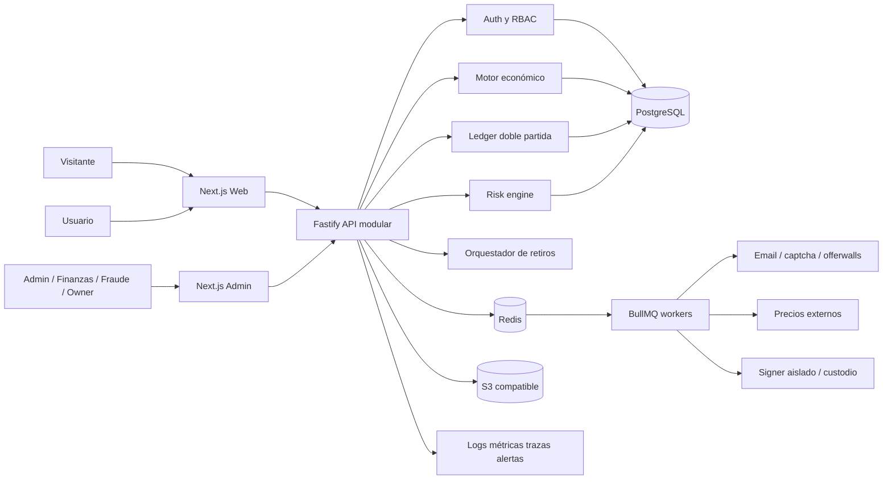
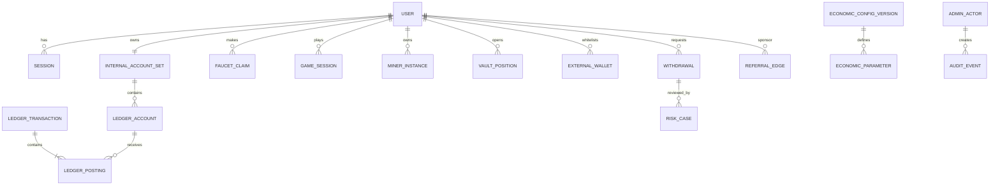
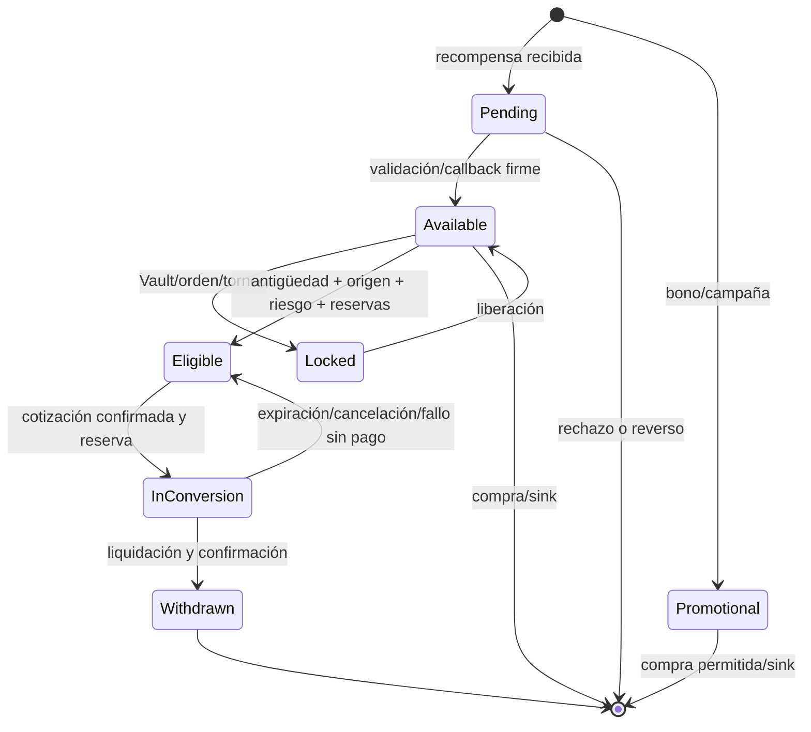
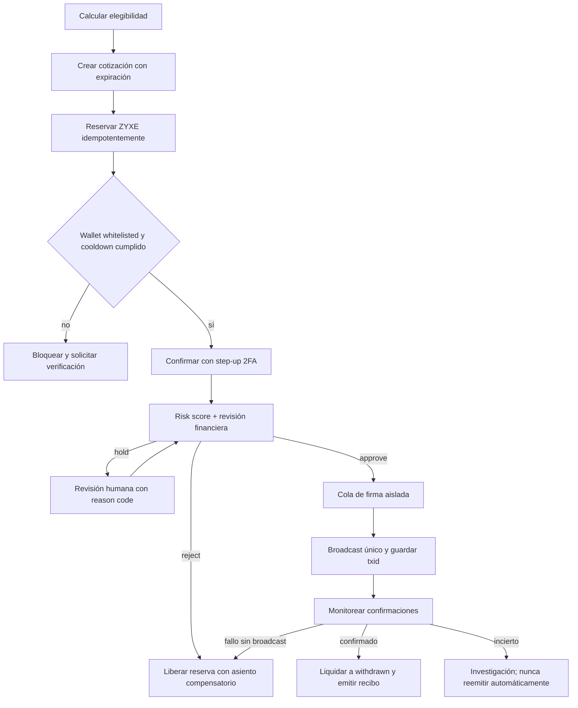

# Fauzet / ZYXE — Diagnóstico y roadmap técnico integral

**Fecha:** 12 de julio de 2026  
**Estado:** línea base de arquitectura y ejecución  
**Fuentes canónicas:** `data/Fauzet_Ficha_Tecnica_Funcionamiento_v0.1.docx` y `data/Fauzet_ZYXE_Documentacion_Tecnica_Economica_v0.1.docx`

## 1. Resumen ejecutivo

Fauzet tiene una especificación funcional/económica amplia, una identidad visual terminada y un prototipo navegable que cubre casi toda la experiencia prevista. No existe todavía una aplicación de producción: no hay repositorio Git, manifiestos de dependencias, backend, base de datos, autenticación real, ledger, infraestructura, pruebas ni integraciones. Todos los saldos y acciones del prototipo viven en datos hardcoded o `localStorage` y pueden alterarse desde el navegador.

La construcción debe comenzar como **monolito modular** con tres superficies separadas: web pública, app autenticada y consola administrativa. El núcleo económico debe ser server-authoritative, transaccional y de doble partida. La beta cerrada no tendrá dinero real, retiros reales ni trading real. Esas capacidades se habilitarán únicamente después de superar gates explícitos de sostenibilidad, seguridad, tesorería y cumplimiento.

### Diagnóstico por activo

| Área          | Estado actual                          | Riesgo / oportunidad                                                           | Acción                                           |
| ------------- | -------------------------------------- | ------------------------------------------------------------------------------ | ------------------------------------------------ |
| Documentación | Dos DOCX completos y dos extractos TXT | Los TXT tienen mojibake y entidades HTML; el DOCX es la fuente canónica        | Versionar requisitos y decisiones abiertas       |
| Landing       | Prototipo visual completo EN/ES        | Contenido/render inline; sin SEO estructurado, analytics ni formularios reales | Migrar conservando diseño y mensajes legales     |
| App           | 18+ módulos navegables                 | Auth, rewards, juegos, economía y retiros son simulaciones locales             | Migrar por verticales contra API                 |
| Admin         | 8 módulos visibles, otros placeholders | Sin login, RBAC, persistencia ni acciones reales                               | Aplicación aislada con step-up auth y auditoría  |
| Branding      | Logos, moneda, iconos y paleta listos  | Duplicación de assets y nombres inconsistentes                                 | Catálogo único y pipeline de optimización        |
| Backend/DB    | Inexistente                            | No hay autoridad, integridad ni trazabilidad                                   | Fastify + PostgreSQL + Redis                     |
| Operación     | Inexistente                            | Sin CI/CD, backups, observabilidad o respuesta a incidentes                    | Infra local reproducible y pipelines por entorno |

### Defectos críticos del prototipo

1. `localStorage` es la autoridad de sesión y saldos; cualquier usuario puede modificarlos.
2. Login, verificación, 2FA y aprobaciones administrativas aceptan acciones sin validación real.
3. Faucet usa `Math.random()` y cooldown local; juegos y misiones no son verificables ni idempotentes.
4. Wallet y dashboard usan fuentes de transacciones distintas; `available`, `eligible`, `locked`, `pending` y `promo` se desincronizan.
5. Conversión/retiro no reserva ni liquida correctamente; el flujo usa tasas inconsistentes y no exige el 2FA mostrado.
6. `innerHTML` y escaping incompleto crean superficie XSS; el admin es accesible por URL sin aislamiento.
7. Hay mojibake literal visible en HTML/JS/TXT. Debe corregirse desde fuente, no con transformaciones en runtime.
8. No hay estados loading/error/empty, manejo de reintentos, accesibilidad de modales ni navegación profunda.

## 2. Fuentes de verdad y reglas no negociables

- La ficha técnica define el ciclo del usuario, los siete estados económicos y el orden de implementación (secciones 3, 4, 7, 8, 11 y 12).
- La documentación económica define modelo de ingresos, pools, sinks, tesorería, ledger, arquitectura, indicadores, riesgos y gates legales (secciones 4–25).
- Los DOCX prevalecen sobre los TXT y sobre cifras hardcoded del prototipo.
- Todo parámetro marcado como hipótesis se guardará como configuración versionada; nunca como constante dispersa.
- ZYXE será saldo interno no transferible durante el MVP. No se acuñará token público.
- No habrá retiros reales en beta cerrada. Trading MVP será educativo/simulado.

## 3. Arquitectura objetivo

### Stack recomendado

| Capa           | Tecnología                                                            | Justificación                                                    |
| -------------- | --------------------------------------------------------------------- | ---------------------------------------------------------------- |
| Monorepo       | pnpm workspaces + Turborepo                                           | Contratos y tooling compartidos sin mezclar despliegues          |
| Web            | Next.js 16, React 19, TypeScript                                      | App Router, SSR/SEO, rutas separadas y componentes reutilizables |
| API            | Fastify + TypeScript + Zod                                            | Validación explícita, buen rendimiento y modularidad             |
| Datos          | PostgreSQL + Prisma                                                   | Transacciones ACID, constraints, migraciones y tipado            |
| Cache/jobs     | Redis + BullMQ                                                        | Cooldowns, locks, rate limits, idempotencia temporal y workers   |
| Auth           | Sesiones opacas en cookie segura + Argon2id + TOTP/WebAuthn posterior | Revocación, dispositivos y step-up auth                          |
| Objetos        | S3 compatible                                                         | Evidencias KYC/fraude y exportaciones fuera de la DB             |
| Observabilidad | OpenTelemetry + Prometheus/Grafana + Sentry                           | Trazas, métricas, errores y alertas                              |
| Infra local    | Docker Compose                                                        | PostgreSQL, Redis, Mailpit y MinIO reproducibles                 |

No se recomiendan microservicios para el MVP. El monolito modular conserva transacciones contables fuertes. Los primeros candidatos a extracción futura son notificaciones, risk engine, market data y blockchain signer.

### Límites de módulos

`identity`, `access`, `ledger`, `economy-config`, `rewards`, `games`, `missions`, `mining`, `store`, `referrals`, `vault`, `market`, `conversions`, `withdrawals`, `treasury`, `risk`, `admin`, `audit`, `notifications`, `support`.

Cada módulo expone casos de uso y eventos; ningún módulo escribe directamente balances de otro. Toda mutación económica pasa por el servicio de contabilización.

## 4. Modelo de datos e invariantes

### Entidades núcleo

- Identidad: `users`, `user_profiles`, `sessions`, `devices`, `email_verifications`, `mfa_methods`, `role_assignments`, `terms_acceptances`.
- Contabilidad: `ledger_accounts`, `ledger_transactions`, `ledger_postings`, `balance_snapshots`, `reconciliation_runs`.
- Economía: `economic_config_versions`, `economic_parameters`, `reward_budgets`, `treasury_accounts`, `treasury_reconciliations`.
- Rewards: `faucet_claims`, `game_sessions`, `game_events`, `missions`, `mission_progress`, `reward_events`, `provider_callbacks`.
- Utilidad: `catalog_products`, `purchases`, `inventories`, `miners`, `energy_events`, `mining_pools`, `mining_settlements`, `vault_positions`, `vault_settlements`.
- Red: `referral_edges`, `referral_ancestors`, `commission_events`, `clawbacks`.
- Mercado/valor externo: `market_quotes`, `orders`, `trades`, `conversion_quotes`, `conversions`, `external_wallets`, `withdrawals`, `blockchain_transactions`.
- Control: `risk_signals`, `risk_scores`, `risk_cases`, `admin_audit_events`, `feature_flags`, `outbox_events`, `idempotency_keys`.

### Invariantes contables

1. Cada transacción posteada suma cero entre débitos y créditos por activo.
2. Los importes usan enteros en unidad mínima o `NUMERIC`, nunca `float`.
3. Un balance es una proyección del ledger, no un campo editable de usuario.
4. Un `source_type + source_id + operation` es único.
5. Un reverso referencia la transacción original y crea asientos compensatorios; no borra ni edita historia.
6. Ninguna cuenta de usuario o tesorería puede quedar negativa salvo cuenta técnica explícitamente autorizada.
7. `promotional` nunca se mueve a `eligible`.
8. `pending`, `locked` y `reserved/conversion` no se pueden gastar ni retirar.
9. El Owner solo debita `treasury:owner:available`; un constraint/policy impide usar rewards, withdrawals, liquidity o security.
10. Cambios administrativos requieren actor, motivo, before/after y, sobre umbral, segunda aprobación.

## 5. Ciclo de vida de saldos

El nombre externo **en conversión** se implementará internamente como una cuenta `reserved:conversion` para evitar ambigüedad con otros bloqueos. `balance_after` será evidencia auxiliar, no fuente de verdad.

## 6. Motor económico

Todas las reglas toman un `economic_config_version_id` y guardan la versión usada en cada transacción.

- **Emisión:** `presupuesto_base + fracción_ingresos - ajuste_inflación - ajuste_fraude - ajuste_reservas`, limitada por pool.
- **Minería:** `(hashpower_válido_usuario / hashpower_total_válido) × pool_diario`; el job de settlement distribuye exactamente el total asignable y registra residuo de redondeo.
- **Vault:** `(peso_usuario / peso_total) × pool_periodo`; multiplicadores iniciales 1.00/1.05/1.15/1.35 son hipótesis configurables.
- **Referidos:** 5/2/1/0.5% preliminar solo sobre base monetizable validada, con cap, actividad, no autocuentas, no comisión sobre comisión y clawback.
- **Compras:** split por producto; default experimental 40% burn, 40% reward pools, 20% treasury.
- **Elegibilidad:** recompensas firmes de origen permitido menos promos, holds, reservas, sanciones, límites y riesgo.
- **Owner available:** ingresos conciliados menos obligaciones, costos, provisiones, reservas y colchón aprobado.

Antes de publicar una versión económica, admin mostrará simulación sobre 7/30/90 días, cambio en pasivos, inflación, cobertura y usuarios afectados. Publicar requiere motivo y doble aprobación cuando cambie convertibilidad o reservas.

## 7. Superficie de API

Prefijo `/v1`. Mutaciones económicas exigen `Idempotency-Key`; las respuestas incluyen `requestId` y versión de contrato.

| Dominio          | Endpoints principales                                                                                             |
| ---------------- | ----------------------------------------------------------------------------------------------------------------- |
| Auth             | `POST /auth/register`, `/login`, `/logout`, `/refresh`, `/verify-email`, `/password/*`, `/mfa/*`; `GET /sessions` |
| Usuario          | `GET/PATCH /me`, `GET /me/devices`, `/me/notifications`, `/me/limits`                                             |
| Dashboard/Ledger | `GET /dashboard`, `/balances`, `/ledger`, `/ledger/:id`                                                           |
| Faucet           | `GET /faucet/status`, `POST /faucet/challenges`, `/faucet/claims`                                                 |
| Juegos           | `POST /games/:game/sessions`, `/events`, `/complete`; `GET /games/catalog`                                        |
| Misiones         | `GET /missions`, `POST /missions/:id/claim`                                                                       |
| Minería/Store    | `GET /miners`, `/mining/status`, `/catalog`; `POST /purchases`, `/miners/:id/energy`                              |
| Vault            | `GET /vault/products`, `/vault/positions`; `POST /vault/positions`, `/:id/close`                                  |
| Crew             | `GET /referrals/code`, `/referrals/tree`, `/referrals/commissions`                                                |
| Mercado          | `GET /market/quotes`; `POST /market/orders`; trading real deshabilitado por flag                                  |
| Conversión       | `POST /conversion-quotes`, `/conversions`; `GET /conversions/:id`                                                 |
| Wallet externa   | `GET/POST /external-wallets`, `POST /:id/verify`, `DELETE /:id`                                                   |
| Retiros          | `GET/POST /withdrawals`, `GET /:id`, `POST /:id/cancel`                                                           |
| Admin            | usuarios, economía, treasury, withdrawals, risk, ledger, audit y content bajo `/admin/*`                          |
| Integraciones    | callbacks firmados bajo `/webhooks/:provider`; health bajo `/health/*`                                            |

Roles: visitante, usuario, usuario verificado, soporte, contenido, fraude, finanzas, auditor, superadmin y owner. La autorización se revalida en cada handler/caso de uso; nunca depende solo del proxy web.

## 8. Seguridad y modelo de amenazas

| Amenaza                  | Control por diseño                                                                                            |
| ------------------------ | ------------------------------------------------------------------------------------------------------------- |
| Robo de cuenta           | Argon2id, cookies HttpOnly/Secure/SameSite, rotación de sesión, TOTP, WebAuthn futuro, alertas de dispositivo |
| Doble claim/pago         | Unique constraints, idempotency, locks cortos y máquina de estados transaccional                              |
| Manipulación de puntajes | Sesión firmada, nonce, secuencia de eventos, límites físicos, anti-replay y validación server-side            |
| Callback falso           | HMAC/clave pública, allowlist, timestamp, raw-body verification y deduplicación                               |
| XSS/CSRF                 | React escaping, CSP estricta, sin HTML no confiable, CSRF/origin checks y cookies SameSite                    |
| Abuso interno            | RBAC mínimo, step-up auth, maker-checker, auditoría append-only y alertas                                     |
| Exfiltración de llaves   | Signer/custodio aislado, KMS/HSM, hot wallet limitada, sin claves en app/DB/repositorio                       |
| Supply chain             | lockfile, Dependabot/Renovate, SBOM, escaneo SAST/secrets/dependencias e imágenes firmadas                    |
| Pérdida de datos         | backups cifrados, PITR, restore drills y reconciliación diaria                                                |

Kill switches independientes para faucet, juegos con rewards, minería, Vault, trading, conversiones, user withdrawals y owner withdrawals.

## 9. Antifraude

Pipeline: evento → señales → score versionado → decisión (`allow`, `challenge`, `hold`, `review`, `reject`) → caso humano → asiento/reverso → aprendizaje de regla.

Señales iniciales: velocidad, IP/ASN/VPN/datacenter/TOR, device binding respetuoso de privacidad, cuentas relacionadas, email desechable, reputación, anomalías de juego, repetición de callbacks, árbol circular, wash trading, cambios recientes de credenciales/wallet y concentración de payouts.

Toda decisión guarda códigos de razón, evidencia, versión del modelo/reglas y actor. Métricas: fraude confirmado, reversos, precision/recall sobre casos resueltos, falsos positivos, aging de cola, tiempo de revisión y pérdida evitada.

## 10. Retiro de extremo a extremo

La beta cerrada usará un adaptador `sandbox` que genera txid ficticio marcado como prueba. El adaptador real no se habilita por configuración accidental: requiere artefacto de aprobación, flag de entorno y credencial ausente en entornos no autorizados.

## 11. Frontend de producción

- Rutas: `/`, `/auth/*`, `/app/*` y `/admin/*`; se recomienda despliegue/admin origin separado en producción.
- Server Components para shells y datos iniciales; Client Components solo para juegos, formularios y controles interactivos.
- TanStack Query para mutaciones/estado remoto; Zod para contratos; localStorage únicamente para idioma/tema.
- Design tokens Fauzet: `#39FF88`, `#7C3AED`, `#22D3EE`, `#080B12`, `#111827`, `#E5E7EB`.
- i18n EN/ES por claves completas, formatos según locale y auditoría que impida strings huérfanos.
- Migración vertical: auth → dashboard/ledger → faucet → games/missions → mining/store → Vault/crew → mercado demo → conversion sandbox → admin.
- Accesibilidad: labels, teclado, focus trap, `dialog`, announcements, contraste, reduced motion y pruebas axe.
- El prototipo queda preservado bajo `legacy-prototype/` como referencia visual, no como código importado en runtime.

## 12. Fases, milestones y gates

### Fase 0 — Fundación y cierre de diseño (Now)

Entregables: monorepo, ADRs, contratos, schema inicial, Docker local, CI, catálogo de assets, corrección de encoding, feature flags y simulador económico básico.

**DoD:** entorno reproducible con un comando; lint/typecheck/test/build verdes; decisiones abiertas registradas con owner y fecha.

### Fase 1 — Beta cerrada, economía interna

Auth/email, dashboard, ledger doble partida, buckets, faucet, Tap Miner, Memory Drops, misiones, wallet/historial, admin básico, auditoría, soporte y notificaciones.

**Aceptación:** un claim y un resultado solo acreditan una vez bajo concurrencia; cada balance reconcilia; pool reparte exactamente su presupuesto; admin no puede editar saldo; pruebas e2e cubren el flujo Mateo. Retiros/trading real deshabilitados.

### Fase 2 — Beta de monetización

Callbacks sandbox/reales de proveedor, rewarded ads/offerwall, catálogo/boosts, inventario, mineros/energía, referidos hasta cuatro niveles detrás de gate legal, tesorería y conciliación de ingresos.

**Gate:** unit economics observables, callback firmado y reversible, fraude dentro del umbral, aprobación legal del modelo referral.

### Fase 3 — Beta pública controlada

Vault interno, temporadas, risk engine avanzado, KYC por umbral, conversiones y retiros sandbox; luego piloto real allowlisted, manual y de límites bajos con un solo activo.

**Gate de dinero real:** concepto jurídico escrito, reservas 3–6 meses, runbook y DR probados, auditoría de seguridad, reconciliación 100%, signer aislado, doble aprobación y kill switch ensayado.

### Fase 4 — Producción

Retiros controlados, SLA operativo, soporte, fraude 24/7 según volumen, automatización progresiva y pruebas de carga/caos. Microtrading real permanece fuera hasta gate propio.

### Fase 5 — Later

Marketplace, más activos, apps móviles y evaluación de token público en red existente. Tokenización requiere auditoría de contrato, legal multijurisdicción, reservas, utilidad orgánica y gobernanza. Red propia queda fuera del alcance inicial.

## 13. Pruebas y QA

- Unitarias: fórmulas, state machines, policies RBAC/riesgo, precisión y redondeo.
- Integración: repositorios, transacciones, outbox, Redis locks, callbacks y workers.
- Property-based: doble partida suma cero, balances no negativos, reversos simétricos, owner isolation.
- Concurrencia: claims, compras, commission settlement y withdrawals repetidos/paralelos.
- E2E: landing→registro→email→onboarding→claim→juego→wallet; admin consulta ledger; sandbox withdrawal en fase habilitada.
- Seguridad: OWASP ASVS, SAST/DAST, dependency/secret scanning, pentest antes de dinero real.
- Antifraude: datasets sintéticos, replay, bot cadence, device farms, callback duplication, referral cycles y wash trading.
- Performance: p95 API, login/claim bursts, daily settlements, admin exports y chain confirmations.
- Recuperación: restore mensual en beta y más frecuente con dinero real; RPO/RTO medidos.

## 14. DevOps y operación

Entornos `local`, `test`, `staging`, `production`; cuentas y secretos aislados. CI ejecuta format, lint, typecheck, unit, integration, migration check, build, SAST y SBOM. CD usa migraciones expand/contract, smoke tests, promoción explícita y rollback de aplicación; las migraciones destructivas requieren backup y aprobación.

SLIs: disponibilidad, latencia p95/p99, errores, lag de jobs, reconciliación, claim success, callback lag, withdrawal aging, cobertura, risk queue. Alertas económicas provienen de la sección 22: inflación, concentración, sostenibilidad, reversos, cobertura y pasivo elegible.

## 15. Cumplimiento y legal

Antes de valor externo: mapa de jurisdicciones, edad/país, Términos, Privacidad, Rewards Policy, Risk Disclosure, Withdrawal Policy, Cookie Policy, AML/KYC/sanciones, protección de datos, consumidor, impuestos, publicidad, juegos y referral compensation.

No usar lenguaje de inversión, APY garantizado, minería real ni ingresos garantizados. El análisis legal del documento es preliminar y debe actualizarse con asesoría jurídica vigente antes de depósitos, custodia, conversión, trading real, Vault con valor externo, cuatro niveles monetarios o token público.

## 16. Decisiones abiertas

| Decisión            | Recomendación de trabajo                                         | Gate                           |
| ------------------- | ---------------------------------------------------------------- | ------------------------------ |
| Valor ZYXE          | Sin precio público; unidad interna y escenarios simulados        | Tesorería + legal              |
| Suministro 1B       | Mantener solo como hipótesis de simulación                       | Tokenization review            |
| Emisión/pools       | Presupuestos diarios configurables con caps                      | Datos beta                     |
| Faucet/cooldown     | Experimentos versionados por cohortes                            | Fraude/retención               |
| Referidos 5/2/1/0.5 | Deshabilitados monetariamente hasta validar unit economics/legal | Legal + finanzas               |
| Split 40/40/20      | Default experimental por producto                                | Simulación 30/90 días          |
| Vault               | Pool variable interno, sin APY                                   | Legal + sostenibilidad         |
| Cripto retiro       | Comparar LTC y DOGE; no elegir aún                               | Custodia, fee, liquidez, legal |
| KYC                 | Por riesgo/umbral/jurisdicción                                   | Política AML                   |
| Custodia            | Proveedor/HSM antes que claves propias en app                    | Security review                |
| Cloud               | Decidir tras requisitos regulatorios, residencia y presupuesto   | ADR infra                      |

## 17. Backlog inicial

Estimación relativa: S (1–3 d), M (3–7 d), L (1–2 sem), XL (requiere división). Dependencias entre paréntesis.

| Epic                | Historias/tareas principales                                         | Tamaño | Dependencias    |
| ------------------- | -------------------------------------------------------------------- | -----: | --------------- |
| E0 Fundación        | Monorepo, tooling, Docker, CI, env schema, ADRs                      |      L | —               |
| E1 Identidad        | Registro, email, sesiones, reset, dispositivos, TOTP, RBAC           |     XL | E0              |
| E2 Ledger           | Accounts, postings, transaction service, idempotency, reconciliation |     XL | E0              |
| E3 Config económica | Versiones, publish workflow, impact preview, flags                   |      L | E2              |
| E4 Web shell        | Tokens, i18n, landing, auth, layouts, accessibility                  |     XL | E0/E1           |
| E5 Dashboard/Wallet | Proyecciones, historial, filtros, receipts                           |      L | E2/E4           |
| E6 Faucet           | Challenge, cooldown, budgets, risk hooks, claim                      |      L | E2/E3           |
| E7 Games/Missions   | Signed sessions, Tap/Memory validators, progress, caps               |     XL | E2/E3           |
| E8 Admin/Audit      | Isolated auth, users, ledger, configs, append-only audit             |     XL | E1–E3           |
| E9 Store/Mining     | Catalog, purchases, inventory, energy, pools, settlement             |     XL | E2/E3           |
| E10 Referrals       | Immutable ancestry, qualification, commissions, clawback             |     XL | E2/E3/legal     |
| E11 Vault           | Products, positions, weight, settlement, early exit                  |      L | E2/E3/legal     |
| E12 Risk            | Signals, scoring, cases, reason codes, review UI                     |     XL | E1/E8           |
| E13 Monetization    | Provider abstraction, signed callbacks, reconciliation               |     XL | E2/E12          |
| E14 Conversion      | Eligibility, quote, reserve, expiry                                  |      L | E2/E12/treasury |
| E15 Withdrawals     | Whitelist, 2FA, state machine, sandbox signer, monitor               |     XL | E12/E14         |
| E16 Operations      | OTel, dashboards, alerts, backups, DR, runbooks                      |     XL | E0 onward       |

## 18. Now / Next / Later

| Now                                                                                  | Next                                                                                                      | Later                                                                   |
| ------------------------------------------------------------------------------------ | --------------------------------------------------------------------------------------------------------- | ----------------------------------------------------------------------- |
| Fundación, ADRs, encoding, auth, ledger, dashboard, faucet, dos juegos, admin básico | Monetización, store, mining, referrals gateados, Vault interno, antifraude, treasury, sandbox withdrawals | Piloto real, marketplace, más activos, apps, token público condicionado |

## 19. Checklist maestro de salida a producción

- [ ] Requisitos y parámetros versionados; decisiones abiertas con owner.
- [ ] Auth, email, sesiones, dispositivos, 2FA y RBAC auditados.
- [ ] Ledger doble partida, idempotencia, reversos y reconciliación probados.
- [ ] Separación de saldos y fondos enforced por constraints/policies.
- [ ] Rewards y juegos validados server-side con budgets y antifraude.
- [ ] Admin aislado, step-up auth, maker-checker y audit log.
- [ ] Kill switches probados por módulo.
- [ ] Integraciones con firma, dedupe, reintentos y conciliación.
- [ ] Observabilidad, alertas económicas/técnicas y runbooks activos.
- [ ] Backups cifrados, PITR y restore drill exitoso.
- [ ] QA unit/integration/property/concurrency/e2e/security/load verde.
- [ ] Accesibilidad, responsive, i18n y encoding verificados.
- [ ] Políticas y concepto jurídico aprobados para el alcance habilitado.
- [ ] Tesorería, reservas, cobertura y Owner isolation reconciliados.
- [ ] Signer/custodio aislado, hot wallet limitada y doble aprobación.
- [ ] Sandbox completo antes de cualquier retiro real.
- [ ] Piloto allowlisted con límites bajos y monitoreo reforzado.
- [ ] Rollback, incident response y comunicación al usuario ensayados.
- [ ] Token público, trading real y red propia permanecen apagados sin sus gates.
